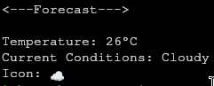

# Weather script to pull data from BOM in Australia

## Showcase

**Waybar Widget**


**Terminal Output**



## This script

-   Pulls current observation data from any of BOM's weather stations
-   Outputs an icon, max temp of the observation and a small snippet of the conditions. E.g `Cloudy`
-   Supports output formats for the following widget managers:

    -   Waybar
    -   (Fabric) - Coming soon!

    > Happy to adjust for your chosen widget manager/framework, just submit an issue.

## Installation

### Downloading

Download the script by downloading the zip or cloning the repo:

```
git clone https://github.com/DrR0X-glitch/bom-weather-script.git
cd bom-weather-script
```

### Testing

Now you can test the script by running:

```
python3 weather.py terminal IDV10450
```

You should see an output similar to this:

```
<---Forecast--->

Temperature: 24°C
Current Conditions: Partly cloudy
Icon: 🌤️
```

## Usage

You can use the `-h` flag for command line help.

### Changing the location of the forecast

#### Getting your Product ID

To change the location of the forecast you will need to go to [this](http://www.bom.gov.au/catalogue/anon-ftp.shtml) site and search in the lower search bar for the location you want. You want to copy the `IDVxxxxx` value.

> **WARNING:** It must be `IDV` followed by 5 numbers or it will not work.

#### Using your Product ID

Now when you run the command switch the default product id for yours. To test it out run:

```
python3 weather.py terminal [YOUR PRODUCT ID]
```

### Changing the output type

There are 2 main output types:

-   **Terminal:** This is mainly for testing, it simple prints the firecast to the terminal
-   **Waybar:** This prints out a formatted json object containing the forecast in this format: `🌤️ 26°C Partly Cloudy` More info [here](#waybar)

## TODO

-   Support for other widget managers/frameworks
-   Pulling town name as well for multiple weather forecasts in one widget

# Widget configs

## Waybar

To use this with waybar you simple need to place `weather.py` in `.config/waybar/scripts` and use this custom module:

```
    "custom/weather": {
        "format": "{}",
        "interval": 600,
        "exec": "python3 $HOME/.config/waybar/scripts/weather.py waybar [YOUR Product ID]",
        "return-type": "json"
    }
```

### Customising the settings

-   Change the forecast location:
    -   Modify the `exec` command and replace `[YOUR Product ID]` with a valid product id. You can get one from [here](#getting-your-product-id)
-   Change how often it is updated:
    -   Change the `interval` amount to the number of seconds between updates
    -   **Default:** 10 Minutes
